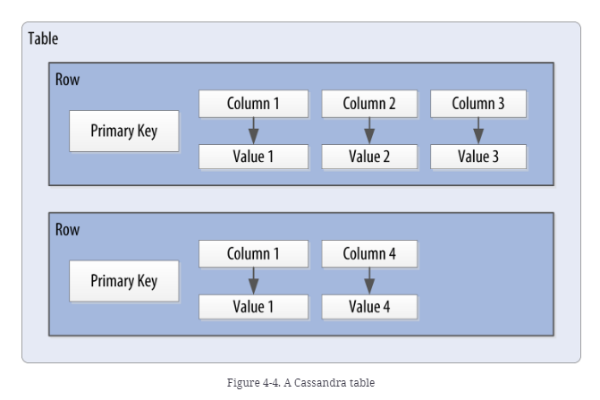
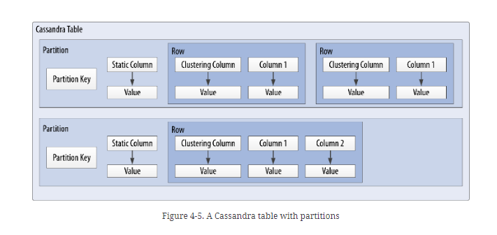
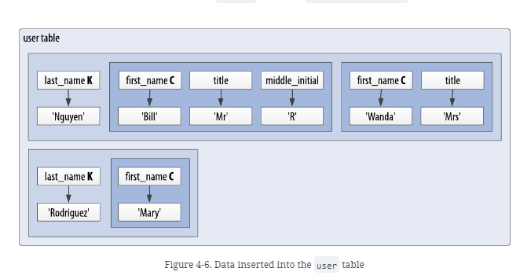
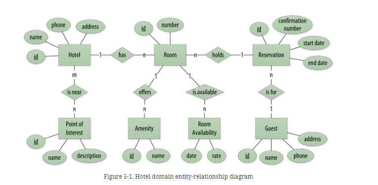
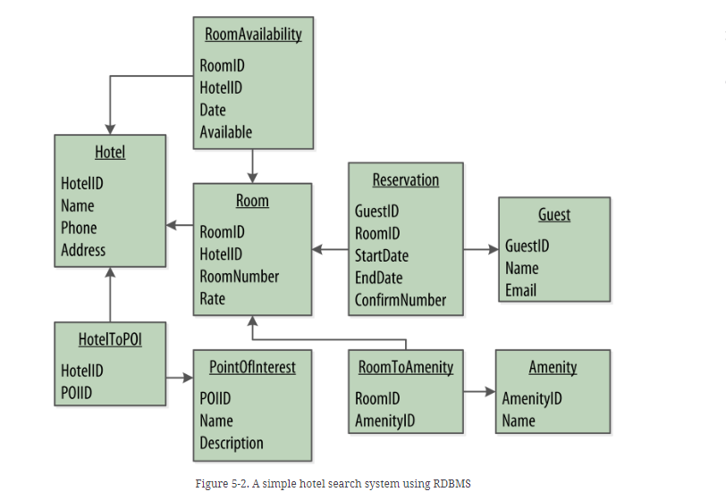
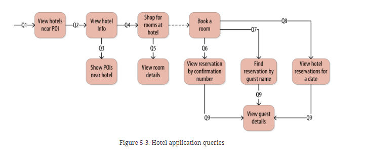
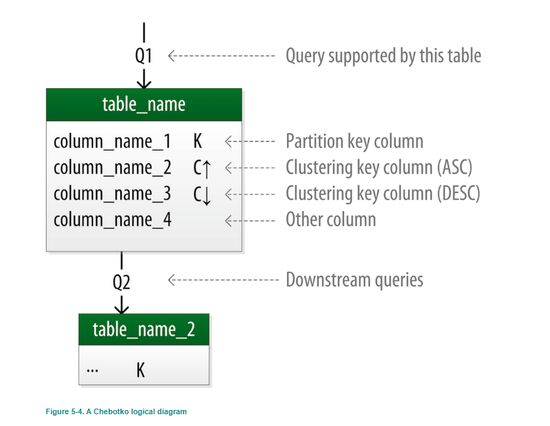
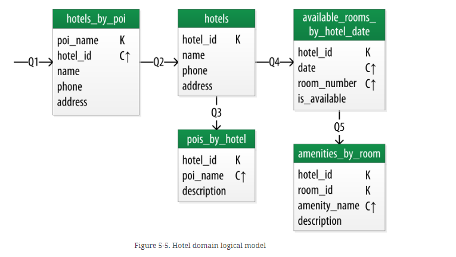
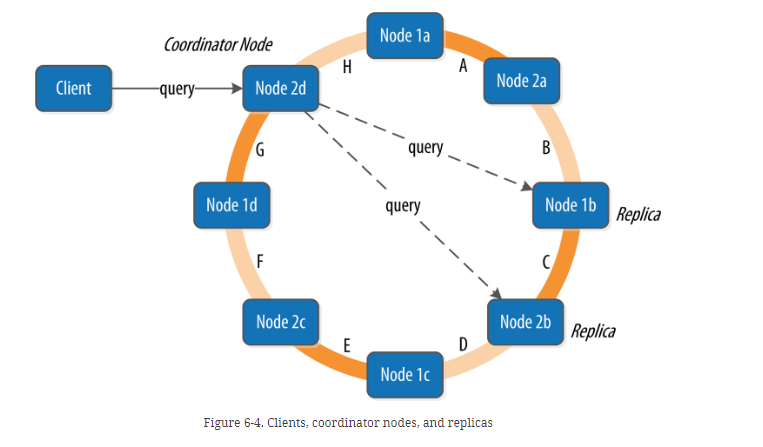

# Cassandra

## Cassandra Data Modeling Basics

* https://www.datastax.com/blog/basic-rules-cassandra-data-modeling

## Gossip Protocol

* Allows nodes to exchange information about themselves with other nodes

## Hinted Handoff

https://cassandra.apache.org/doc/latest/cassandra/operating/hints.html#:~:text=Hinted%20handoff%20is%20the%20process,with%20Replication%20Factor%20of%203%20.

* Data repair technique applied during write operations
* Oe of the ways that Cassandra implements the eventual consistency guarantee that all updates are eventually received by all replicas

## Installing Cassandra

```
cqlsh> CREATE KEYSPACE my_keyspace WITH replication = {'class':
  'SimpleStrategy', 'replication_factor': 1};
```

- `replication_factor` indicates how many nodes the data in this keyspace will be written to
- If `replication_factor = 3` that means each node will be responsible for 3 token ranges and each piece of data you write will live on 3 separate nodes
  - Reminder that the `token` is created by taking a hash of the `primary key` of the row

```
cqlsh:my_keyspace> CREATE TABLE user (first_name text, last_name text, title text, PRIMARY KEY (last_name, first_name));
```

- Creates a new table called `user` in the current keyspace with 3 columns: `first_name`, `last_name`, and `title`
- **Note here that last_name is the partition key because it is the first value in the primary key and first_name is
  the cluster key**

```
cqlsh:my_keyspace> DESCRIBE TABLE user;

CREATE TABLE my_keyspace.user (
    last_name text,
    first_name text,
    title text,
    PRIMARY KEY (last_name, first_name)
) WITH CLUSTERING ORDER BY (first_name ASC)
    AND additional_write_policy = '99p'
    AND bloom_filter_fp_chance = 0.01
    AND caching = {'keys': 'ALL', 'rows_per_partition': 'NONE'}
    AND cdc = false
    AND comment = ''
    AND compaction = {'class': 'org.apache.cassandra.db.compaction.SizeTieredCompactionStrategy', 'max_threshold': '32', 'min_threshold': '4'}
    AND compression = {'chunk_length_in_kb': '16', 'class': 'org.apache.cassandra.io.compress.LZ4Compressor'}
    AND crc_check_chance = 1.0
    AND default_time_to_live = 0
    AND extensions = {}
    AND gc_grace_seconds = 864000
    AND max_index_interval = 2048
    AND memtable_flush_period_in_ms = 0
    AND min_index_interval = 128
    AND read_repair = 'BLOCKING'
    AND speculative_retry = '99p';
```

- `text` and `varchar` are the same thing and are used to store strings
- Inserting and selecting

```
cqlsh:my_keyspace> INSERT INTO user (first_name, last_name, title) VALUES ('Bill', 'Nguyen', 'Mr.');
cqlsh:my_keyspace> SELECT * FROM user WHERE first_name = 'Bill' AND last_name = 'Nguyen';

 last_name | first_name | title
-----------+------------+-------
    Nguyen |       Bill |   Mr.

(1 rows)
```

- Searching by last name

```
cqlsh:my_keyspace> SELECT * FROM user where last_name = 'Nguyen';
```

- Searching by fist name

```
cqlsh:my_keyspace> SELECT * FROM user where first_name = 'Bill';
InvalidRequest: Error from server: code=2200 [Invalid query] message="Cannot execute this query as it might involve data filteri
ng and thus may have unpredictable performance. If you want to execute this query despite the performance unpredictability, use ALLOW FILTERING"
```
- Note we get the above error because of the primary key that we used for this table
    - I think this makes sense because partition key tells Cassandra where to look, without this, Cassandra would need
      to look through everything
    - So you can either query using the partition key + cluster key(s) or just partition key

### Counting Data and Full Table Scans

```
cqlsh:my_keyspace> SELECT COUNT(*) FROM user;

 count
-------
     1

(1 rows)

Warnings :
Aggregation query used without partition key
```

- Note the warning here
- In a multi-node cluster with large amounts of data, this `COUNT` could be a very expensive operation

### Deleting

```
cqlsh:my_keyspace> DELETE title FROM user WHERE first_name = 'Bill' and last_name = 'Nguyen';
cqlsh:my_keyspace> SELECT * FROM user WHERE first_name = 'Bill' AND last_name = 'Nguyen';

 last_name | first_name | title
-----------+------------+-------
    Nguyen |       Bill |  null

(1 rows)
```

- Deleting entire row

```
cqlsh:my_keyspace> DELETE FROM user WHERE first_name = 'Bill' AND last_name = 'Nguyen';
cqlsh:my_keyspace> SELECT * FROM user;

 last_name | first_name | title
-----------+------------+-------

(0 rows)
```

- Can remove all the data using the `TRUNCATE` command or you can use the `DROP TABLE` command to delete the table cqlsh:my_keyspace> DROP TABLE user;

  schema

```
cqlsh:my_keyspace> TRUNCATE user;
cqlsh:my_keyspace> DROP TABLE user;
```

## The Cassandra Query Language

- Cassandra defines a *table* to be a logical division that associates similar data
- For example you might have a `user` table, a `hotel` table, an `address` table, etc
- *In this way, a Cassandra table is analogous to a table in the relational world*

<br>

- Imagine a form backed by Cassandra, there may be some fields that are optional and some that are required
- In Cassandra, instead of storing null for those values you don't know (which would waste space), you just don't
  store that column at all for that row
- This data structure is characteristic of Cassandra and other databases classified as *wide column* stores

<br>

- Primary keys in Cassandra are a fundamental topic that will affect your understanding of Cassandra's architecture
  and data model, how Cassandra reads and writes data, and how it is able to scale
- Cassandra uses a special type of primary key called a `composite key` (aka compound key) to represent groups of
  related rows called `partitions`
- The `composite key` consists of a `partition key` plus an optional set of `clustering columns`
- The `partition key` is used to determine the nodes on which rows are stored and can itself consist of multiple columns
- The `clustering columns` are used to control how data is sorted for storage within a partition
- Cassandra also supports an additional construct called a `static column`
    - This is for storing data that is not part of the primary key but is shared by every row in a partition



- Below image shows how each partition is uniquely identified by a partition key, and how the clustering keys are
  used to uniquely identify rows WITHIN a partition
- Where no clustering columns are provided, each partition consists of a single row



- Putting all of this together, we have the basic Cassandra data structures
    - *Columns* - name/value pair
    - *Row* - container for columns referenced by a primary key
    - *Partition* - group of related rows that are stored together on the same nodes
    - *Table* - container for rows organized by partitions
    - *Keyspace* - container for tables
    - *Cluster* - container for keyspaces that spans one or more nodes

### Clusters

- Cassandra is designed to be distributed over several machines operating together that appear as a single instance
  to an end user
- A *cluster* is sometimes called a *ring*

### Keyspaces

- Corresponds to *database* in the relational model
- Keyspace is a container for tables
- Keyspace has a name and a set of attributes that define keyspace-wide behavior like replication

### Tables

- Ordered collection of rows
- Each row is an ordered collection of columns
-  Rows are organized in partitions and assigned to nodes in a Cassandra according to the column(s) designated as
   the partition key
- Ordering of data within a partition is determined by the clustering columns

<br>

- When you write data to a table in Cassandra, you specify values for one or more columns
- The collection of values is called a *row*
- You must specify a value for each of the columns contained in the *primary key* as those columns taken together
  will uniquely identify the row
- The following updates a row in the second insert statement because the row already exist (the row already existed
  per the primary key)

```
cqlsh:my_keyspace> INSERT INTO user (first_name, middle_initial, last_name, title) VALUES ('Bill', 'S', 'Nguyen', 'Mr.');
cqlsh:my_keyspace> SELECT * FROM user WHERE first_name = 'Bill' AND last_name = 'Nguyen';

 last_name | first_name | middle_initial | title
-----------+------------+----------------+-------
    Nguyen |       Bill |              S |   Mr.

(1 rows)
cqlsh:my_keyspace> INSERT INTO user (first_name, middle_initial, last_name, title) VALUES ('Bill', 'R', 'Nguyen', 'Mr.');       
cqlsh:my_keyspace> SELECT * FROM user WHERE first_name = 'Bill' AND last_name = 'Nguyen';

 last_name | first_name | middle_initial | title
-----------+------------+----------------+-------
    Nguyen |       Bill |              R |   Mr.

```

- Note that there's only a single row after both inserts and just the middle initial was changed
- There's no fundamental difference between insert and update operations
    - Cassandra supports *upsert* (aka inserts and updates are treated the same)

<br>

- Note that with the current data in the table that there are two partitions
    - The "Rodriguez" partition and the "Nguyen" partition



### Columns

- Most basic data structure in the Cassandra data model
- `Timestamps` and `TTL` are key to understanding how Cassandra uses time to keep data current

#### Timestamps

- Each time you write data into Cassandra, a timestamp (in microseconds) is generated for each column value that is
  inserted or updated
- **Cassandra uses these timestamps for resolving any conflicting changes that are made to the same value**
    - This is called **last write wins**
- You can check the timestamp when columns were written doing the following:

```
cqlsh:my_keyspace> SELECT first_name, last_name, title, writetime(title)
  FROM user;

 first_name | last_name | title | writetime(title)
------------+-----------+-------+------------------
       Mary | Rodriguez |  null |             null
       Bill |    Nguyen |   Mr. | 1567876680189474
      Wanda |    Nguyen |  Mrs. | 1567874109804754

(3 rows)
```

- Note that you cannot use the `writetime` function on primary key columns

```
cqlsh:my_keyspace> SELECT writetime(first_name) from USER;
InvalidRequest: Error from server: code=2200 [Invalid query] message="Cannot use selection function writeTime on PRIMARY KEY part first_name"
```

- Cassandra allows you to specify a timestamp you want to use when performing writes
    - This isn't required
    - Usually this is used when there is a concern that some of the writes may cause fresh data to be overwritten
      with stale data


#### TTL

- Cassandra provides the ability to expire data that is no longer needed
- Works at the level of the individual columns
- TTL is a value that Cassandra stores for each column value to indicate how long to keep the value

```
cqlsh:my_keyspace> SELECT first_name, last_name, TTL(title) FROM user WHERE first_name = 'Mary' AND last_name = 'Rodriguez';

 first_name | last_name | ttl(title)
------------+-----------+------------
       Mary | Rodriguez |       null
```

```
cqlsh:my_keyspace> UPDATE user USING TTL 3600 SET middle_initial = 'Z' WHERE first_name = 'Mary' AND last_name = 'Rod
riguez';
cqlsh:my_keyspace> SELECT first_name, middle_initial, last_name, TTL(middle_initial) FROM user where first_name = 'Ma
ry' AND last_name = 'Rodriguez';

 first_name | middle_initial | last_name | ttl(middle_initial)
------------+----------------+-----------+---------------------
       Mary |              Z | Rodriguez |                3577
```

- Note in the above the `3577` so we can see the TTL counting down
- After TTL runs out this column will be null
- You can also put a TTL on an entire row


```
cqlsh:my_keyspace> INSERT INTO user (first_name, last_name) VALUES ('Jeff', 'Carpenter') USING TTL 60;
cqlsh:my_keyspace> SELECT * FROM user where first_name = 'Jeff' AND last_name = 'Carpenter';

 last_name | first_name | middle_initial | title
-----------+------------+----------------+-------
 Carpenter |       Jeff |           null |  null

(1 rows)
cqlsh:my_keyspace> SELECT * FROM user where first_name = 'Jeff' AND last_name = 'Carpenter';

 last_name | first_name | middle_initial | title
-----------+------------+----------------+-------
```

- TTL is stored on a per-column level for non-primary key columns
- No way to obtain or set the TTL value of a *primary key* column

## CQL Types

- *blob*
    - *binary large object* is a computing term for an arbitrary array of bytes
    - Useful for storing media or other binary file types

### Collections

- Sets, lists, and maps
- Useful when we need to store a variable number of elements within a single column

#### Set
- Elements are unordered when stored, but are returned in sorted order
- You can insert additional items without having to read the contents first
```
cqlsh:my_keyspace> ALTER TABLE user ADD emails set<text>;
cqlsh:my_keyspace> UPDATE user SET emails = { 'mary@example.com' } WHERE first_name = 'Mary' AND last_name = 'Rodrigu
ez';
cqlsh:my_keyspace> SELECT emails FROM user WHERE first_name = 'Mary' AND last_name = 'Rodriguez';

 emails
----------------------
 {'mary@example.com'}
```

- Adding values to set

```
cqlsh:my_keyspace> UPDATE user SET emails = emails + {'mary.rodriguez.AZ@gmail.com'} WHERE first_name = 'Mary' AND la
st_name = 'Rodriguez';
cqlsh:my_keyspace> SELECT emails FROM user WHERE first_name = 'Mary' AND last_name = 'Rodriguez';

 emails
-----------------------------------------------------
 {'mary.rodriguez.AZ@gmail.com', 'mary@example.com'}

(1 rows)
```

- You can also clear items from a set by using the subtraction operator
- Can clear out the entry set by using empty set notation `SET emails = {}`

```
...SET emails = emails - {'mary@example.com']
```

#### List

- Ordered list of items
- By default, values are stored in order of insertion

```
cqlsh:my_keyspace> UPDATE user SET phone_numbers = ['1-800-111-2222']
               ... ;
SyntaxException: line 2:0 mismatched input ';' expecting K_WHERE
cqlsh:my_keyspace> UPDATE user SET phone_numbers = ['1-800-111-2222'] WHERE first_name = 'Mary' AND last_name = 'Rodr
iguez';
cqlsh:my_keyspace> SELECT phone_numbers FROM user WHERE first_name = 'Mary' AND last_name = 'Rodriguez';

 phone_numbers
--------------------
 ['1-800-111-2222']
```

```
cqlsh:my_keyspace> UPDATE user SET phone_numbers = phone_numbers + ['408-111-1111'] WHERE first_name = 'Mary' AND las
t_name = 'Rodriguez';
cqlsh:my_keyspace> SELECT phone_numbers FROM user WHERE first_name = 'Mary' AND last_name = 'Rodriguez';

 phone_numbers
------------------------------------
 ['1-800-111-2222', '408-111-1111']

(1 rows)
```

- You can also prepend numbers to the front of the list by reversing the order of the values `SET phone_numbers = ['.
  ....'] + phone_numbers`

- You can replace an individual item in the list when you reference it by its index

```
(1 rows)
cqlsh:my_keyspace> UPDATE user SET phone_numbers[1] = '480-111-1111'
               ...   WHERE first_name = 'Mary' AND last_name = 'Rodriguez';
cqlsh:my_keyspace> SELECT phone_numbers FROM user WHERE first_name = 'Mary' AND last_name = 'Rodriguez';

 phone_numbers
------------------------------------
 ['1-800-111-2222', '480-111-1111']
```

- You can use the subtraction operator to remove items that match a specified value

```
cqlsh:my_keyspace> UPDATE user SET phone_numbers =
               ...   phone_numbers - [ '480-111-1111' ]
               ...   WHERE first_name = 'Mary' AND last_name = 'Rodriguez';
cqlsh:my_keyspace> SELECT phone_numbers FROM user WHERE first_name = 'Mary' AND last_name = 'Rodriguez';

 phone_numbers
--------------------
 ['1-800-111-2222']
```

- You can delete a specific item directly using its index

```
cqlsh:my_keyspace> DELETE phone_numbers[0] from user WHERE
               ...   first_name = 'Mary' AND last_name = 'Rodriguez';
cqlsh:my_keyspace> SELECT phone_numbers FROM user WHERE first_name = 'Mary' AND last_name = 'Rodriguez';

 phone_numbers
---------------
          null
```

- Note: because a list stores values to position, updating or deleting a specific item could require Cassandra to
  read the entire list, perform the operation, and write out the entire list again
    - This could be an expensive operation
    - Because of this, many users prefer to use a `set` or a `map`

#### Map

- Collection of key-value pairs
- Can be of any type except `counter`

```
cqlsh:my_keyspace> ALTER TABLE user ADD login_sessions map<timeuuid, int>;
cqlsh:my_keyspace> UPDATE user SET login_sessions = { now(): 13, now(): 18 } WHERE first_name = 'Mary' and last_name 
= 'Rodriguez';
cqlsh:my_keyspace> SELECT login_sessions FROM user WHERE first_name = 'Mary' and last_name = 'Rodriguez';

 login_sessions
--------------------------------------------------------------------------------------
 {80c46040-7baf-11ed-922d-2db43af4338d: 13, 80c46041-7baf-11ed-922d-2db43af4338d: 18}
```

### Tuples

```
cqlsh:my_keyspace> ALTER TABLE user ADD address tuple<text, text, text, int>;
cqlsh:my_keyspace> UPDATE user SET address = ('7712 E. Broadway', 'Tucson', 'AZ', 85715)
               ... WHERE first_name = 'Mary' AND last_name = 'Rodriguez';
cqlsh:my_keyspace> SELECT address FROM user WHERE first_name = 'Mary' AND last_name = 'Rodriguez';

 address
---------------------------------------------
 ('7712 E. Broadway', 'Tucson', 'AZ', 85715)
```

- This des give us a way to store an address, but it can be difficult to try to remember the positional values of the
  various fields of the tuple without having a name associated with each value
- There is also no way to update individual fields of a tuple; the entire tuple must be updated
- *Tuples are infrequently used in practice because there are better alternatives*

### User-Defined Types

- UDTs are easier to manage than tuples since you can specify the values by name rather than by position

```
cqlsh:my_keyspace> CREATE TYPE address (
               ... street text,
               ... city text,
               ... state text,
               ... zip_code int);
cqlsh:my_keyspace> ALTER TABLE user ADD addresses map<text, frozen<address>>;
```

- Note the `frozen` syntax above - this is because of nested collections

```
cqlsh:my_keyspace> UPDATE user SET addresses = addresses + {'home': { street: '7712 E. Broadway', city: 'Tucson',   state: 'AZ', zip_code: 85715 } } WHERE first_name = 'Mary' AND last_name = 'Rodriguez';
cqlsh:my_keyspace> SELECT addresses FROM user WHERE first_name = 'Mary' AND last_name = 'Rodriguez';

 addresses
--------------------------------------------------------------------------------------
 {'home': {street: '7712 E. Broadway', city: 'Tucson', state: 'AZ', zip_code: 85715}}
```

## Primary Key

### Composite Partition Key

```
CREATE TABLE application_logs (
  id                    INT,
  app_name              VARCHAR,
  hostname              VARCHAR,
  log_datetime          TIMESTAMP,
  env                   VARCHAR,
  log_level             VARCHAR,
  log_message           TEXT,
  PRIMARY KEY ((app_name, env))
);
```

- The inner parenthesis around *app_name* and *env* means that they are BOTH part of a partition key and are not
  clustering keys
- To efficiently retrieve data, the *where* clause in the query must contain all the composite partition keys in the
  same order as specified in the primary key definition

```
select * application_logs where app_name = 'app1' and env = 'prod';
```

### Clustering Key

- **Clustering is a storage engine process of sorting data within a partition and is based on the columns as defined
  as the clustering keys**
- **Grouping tables using clustering columns is the equivalent of JOINs in a relational db**

```
CREATE TABLE application_logs (
  id                    INT,
  app_name              VARCHAR,
  hostname              VARCHAR,
  log_datetime          TIMESTAMP,
  env                   VARCHAR,
  log_level             VARCHAR,
  log_message           TEXT,
  PRIMARY KEY ((app_name, env), hostname, log_datetime)
);
```

- `hostname` and `log_datetime` are the clustering keys
- Cassandra lexically sorts (alphabetical order) the data by the `hostname` and the `log_datetime` within the partition

#### Example

```
cqlsh:my_keyspace> CREATE TABLE cyclist_cat_pts ( category text, points int, id UUID,lastname text, PRIMARY KEY (category) );
cqlsh:my_keyspace> SELECT * FROM cyclist_cat_pts WHERE category = 'GC' ORDER BY points ASC;
InvalidRequest: Error from server: code=2200 [Invalid query] message="Order by is currently only supported on the clustered columns of the PRIMARY KEY, got points"
```

- With this query, the `ORDER BY` doesn't work because `points` isn't a clustered column
- Adding that column to the clustering key part of the primary key fixes that

```
cqlsh:my_keyspace> CREATE TABLE cyclist_cat_pts ( category text, points int, id UUID,lastname text, PRIMARY KEY (category, points) );
cqlsh:my_keyspace> SELECT * FROM cyclist_cat_pts WHERE category = 'GC' ORDER BY points ASC;

 category | points | id | lastname
----------+--------+----+----------

(0 rows)
```

- Checking if `points > 200`
- With points as clustered column

```
cqlsh:my_keyspace> SELECT * FROM cyclist_cat_pts WHERE category = 'GC' AND points > 200 ORDER BY points ASC;

 category | points | id | lastname
----------+--------+----+----------

(0 rows)
```

- With points not as a clustered column

```
cqlsh:my_keyspace> CREATE TABLE cyclist_cat_pts_2 ( category text, points int, id UUID,lastname text, PRIMARY KEY (category) ); 
cqlsh:my_keyspace> SELECT * FROM cyclist_cat_pts_2 WHERE category = 'GC' AND points > 200 ORDER BY points ASC;
InvalidRequest: Error from server: code=2200 [Invalid query] message="Cannot execute this query as it might involve data filteri
ng and thus may have unpredictable performance. If you want to execute this query despite the performance unpredictability, use ALLOW FILTERING"
```

## Data Modeling

- **Data model you use is the most important factor in your success with Cassandra**

### Conceptual Data Modeling

- Hotel Reservation System is example being used



- Rectangles = entities
- Ovals = attributes of entities
- Underlined = unique id for entity
- Diamonds = relationships between entities
- Connectors between relationships (lines) show multiplicity of the connection

#### RDBMS Design



##### Design Differences between RDBMS and Cassandra

- **No Joins**
    - Client either needs to handle this in app code or new denormalized table needs to be created that represents the
      join results
        - Option 2 is preferred
- **No referential integrity**
    - In a relational database, you could specify foreign keys in a table to reference the primary key of a record in
      another table
    - Cassandra does not enforce this
        - Common to store IDs related to other entities in your tables, but operations such as cascading deletes are not
          available
- **Denormalization**
    - Cassandra performs best when data model is denormalized
- **Query-first Design**
    - In Cassandra you start with the query model
    - You model the queries and let the data be organized around them
    - Think of the most common query paths your application will use and then create the tables that you need to
      support them
- **Designing for optimal storage**
    - Because Cassandra tables are each stored in separate files on disk, it's important to keep related columns
      together in the same table
    - A key goal is to minimize the number of partitions that must be searched in order to satisfy a given query
    - Because a partition is a unit of storage that does NOT get divided across nodes, a query that searches a single
      partition will typically yield the best performance
- **Sorting is a design decision**
    - Sorting is only available on clustering columns

### Defining Application Queries

- UI design is a good way to start identifying application queries
- Need to think in terms of how data is written, and it terms of how data will be queried by use cases
- Queries identified
    - Q1. Find hotels near a given point of interest.
    - Q2. Find information about a given hotel, such as its name and location.
    - Q3. Find points of interest near a given hotel.
    - Q4. Find an available room in a given date range.
    - Q5. Find the rate and amenities for a room.
    - Q6. Look up a reservation by confirmation number.
    - Q7. Look up a reservation by hotel, date, and guest name.
    - Q8. Look up all reservations by guest name.
    - Q9. View guest details.



### Logical Data Modeling

- To name each table, identify the primary entity type for which you are querying, and use that to start the entity name
- If you are querying by attributes of other related entities, you append those to the table name - `hotels_by_poi`
- For the primary key of the table
    - Add partition key columns based on the required query attributes, and clustering columns in order to guarantee
      uniqueness and support desired sorting
- **Design of primary key is extremely important, it will determine how much data will be stored in each partition
  and how the data is organized on disk, this will in turn affect how quickly Cassandra processes read queries**
- You complete the design of each table by adding any additional attributes identified by the query
    - If any of these additional attributes are the same for every instance of the partition key, mark the column as
      static
- - Chebotko logical data model example



- Chebotko model for our hotel application



- Note on this setup, there are no dedicated tables for rooms or amenities, this is because out workflow didn't
  identify any queries requiring this direct access

<br>

- Q1 is to find hotels near a point of interested (`hotels_by_poi`)
    - Searching by a named point of interested, so that is a clue that the point of interested should be a part of the
      primary key
    - Could have more than one hotel near a given point of interest, so you'll need another component in your primary
      key in order to make sure you have a unique partition for each hotel
        - This is why `hotel_id` is a clustering column
    - Let's assume that user will provide a name of a point of interest, but would benefit from seeing the description
      of a point of interest alongside the hotel results
        - Could include `poi_description` as a column in the `hotels_by_poi` table, and designate this value as a static
          column since the point of interest description is the same for all the rows in the partition
- **An important consideration in designing your table's primary key is making sure that defines a unique data
  element - otherwise, you run the risk of accidentally overwriting data**
- Q2 you'll need a table to get information about a specific hotel
    - You could put all the attributes of a hotel in the `hotels_by_poi` table, but you choose to add only those
      attributes required by your application workflow
    - The unique identifier from `hotels_by_poi` (`hotel_id`) is used to obtain details about the hotel from the
      `hotels` table
    - Another approach would be to store a set of `poi_names` in the `hotels` table
- Q3 is the inverse of Q1
    - Looking for points of interest near a hotel - `pois_by_hotel`
    - Add the point of interest name as a clustering key to guarantee uniqueness
- Q4, because we need to query over a date range, we need to use the date as a clustering key -
  `available_rooms_by_hotel_date`

---
- **Use clustering columns to store attributes that you need to access in a range query. Remember that order of the
  clustering columns is important**
- **The wide partition pattern**
    - The design of the `available_rooms_by_hotel_date` table is an instance of the *wide partition* (aka *wide row*)
      pattern
    - Essence of the pattern is to group multiple related rows in a partition to support fast access to multiple rows
      within the partition in a single query

---

- Q5 allows user to view amenities of one of the rooms that is available for the desired stay days

## Cassandra Architecture

### Consistency

- Cassandra provides *tuneable consistency*
- Consistency level chosen for each read/write query
- Consistency levels include `ONE`, `TWO`, and `THREE` - each of which specify an absolute number of replica nodes
  that must respond to a request
- `Quorum` consistency level requires a response from a majority of the replica nodes
- *Q = floor(RF/2 + 1);*
    - *Q* represents the number of nodes needed to achieve quorum for a replication factor *RF*
        - If *RF* is 3, then *Q*, quorum, is 2
        - If *RF* is 4, then *Q* is 3
        - If *RF* is 5, then *Q* is 3
- `ALL` consistency level requires a response from all of the replicas
- To achieve `strong consistency` in Cassandra: `R + W > RF = strong consistency`
    - *R* = read replica count
    - *W* = write replica count
    - *RF* = replication factor
    - *Recommended way to achieve strong consistency in Cassandra is to write and read using the QUORUM or
      LOCAL_QUORUM consistency levels*

---

- Replication factor is set per keyspace
- Consistency level is specified per query, by the client
- Replication factor indicates how many nodes you want to use to store a value during each write operation
- Consistency level specifies how many nodes the client has decided must respond in order to feel confident of a
  success read or write operation

### Queries and Coordinator Nodes



- A client may connect to any node in the cluster to initiate a read or write query - this node is called the
  *coordinator node*
- Coordinator identifies which nodes are replicas for the data that is being written or read and forwards the
  queries to them
- For a write, the coordinator node contacts all replicas, as determined by the consistency level and replication
  factor, and considers the write successful when a number of replicas that have responded matches the consistency
  level of the write
- For a read, the coordinator contacts enough replicas to ensure the required consistency level is met

### Lightweight Transactions and Paxos

- Strong consistency is not enough to prevent race conditions in cases where clients need to read, then write data
- Example:
    - Imagine we are building a client that wants to manage user records as part of an account management application
    - In creating a new user account, we'd like to make sure that the user record doesn't already exist, lest we
      unintentionally overwrite existing user data
    - So first we do a read to see if the record exists, and then we create the record if it doesn't exist
- The behavior we're looking for here is called *linearizable consistency* which means that we'd like to guarantee
  that no other client can come in between our read and write queries with their own modifications
- Cassandra supports this with a *lightweight transaction* (LWT)
- Implementation based on Paxos
    - Alternative to traditional two-phase commit-based approaches to distributed transactions

### Bloom Filters

- Used to boost performance of reeds
- Fast, nondeterministic algorithms for testing whether an element is a member of a set
- They are nondeterministic because it is possible to get a false-positive reda from a Bloom
  filter, but not a false-negative
- It's like a special kind of key cache

### Deletion and Tombstones

- Because a node could be down or unreachable when data is deleted, that node could miss a delete
- When that node comes back online later and a repair occurs, the node could "resurrect" the
  data that had been previously deleted by re-sharing it with other nodes
- To prevent this, Cassandra uses *tombstones*
    - Marker that is kept to indicate data that bas been deleted
    - When you execute a delete operation, the data is not immediately deleted - it's treated as
      an update operation that places a tombstone on the value
- A tombstone is similar to a "soft delete" from the relational world
- Tombstones are not kept forever - they are removed as part of compaction
- There is a setting per table called `gc_grace_seconds` which represents the amount of data
  that nodes will wait to garbage collect (or collect) tombstones

## Writing and reading data

## Other Stuff
- Search capability can be added to Cassandra using Apache Lucene
- Can also use Elassandra which is a forked version of Elasticsearch that works as a secondary index implementation
  for Cassandra


CREATE TABLE cycling.cyclist_cat_pts (
category text,
points int,
id UUID,lastname text,
PRIMARY KEY (category)
); 

## Cassandra Secondary Attached Index (SAIs)

- https://www.datastax.com/dev/cassandra-indexing

- Indexes allow you to query columns outside the Cassandra partition key without using the `ALLOW FILTERING` keyword or create custom tables 
  - Also do not need to create custom tables for each query pattern
- You can create a table that is most natural for you and query it any way you want