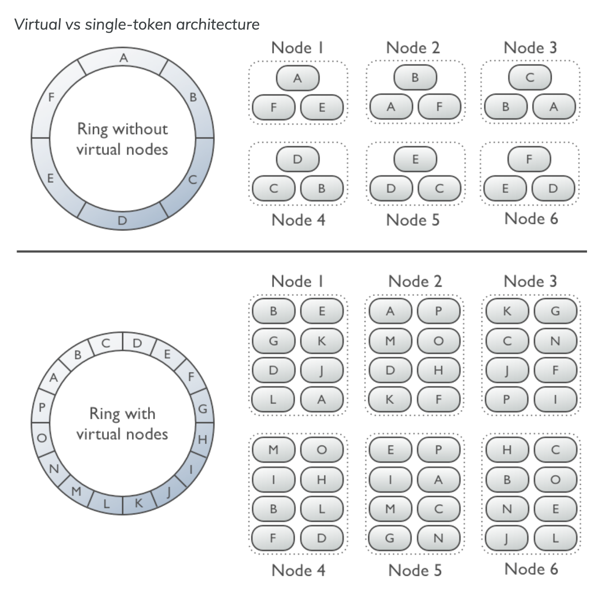

- A node contains multiple vnodews
    - Each vnode is responsible for a specific range of tokens
- A vnode is a small token range that a physical node is responsible for
- Before vnodes, nodes were responsible for large continuous range of tokens


```
Node	Token Range
Node A	1 - 1000
Node B	1001 - 2000
Node C	2001 - 3000
```

- Problem 1: Imbalanced load
    - If Node B is accessed more frequently, it will become overloaded
    If Node C has very little data, it remains underutilized

- Problem 2: Difficult node placement
    - If node B fails, its entire token range much be reassigned
    - Requires rebalancing which is slow and resource-intensive 

- With vnodes, each node is assinged multiple small, random token ranges

```
Node	Token Ranges
Node A	1-100, 901-1000, 1801-1900
Node B	101-200, 1001-1100, 1901-2000
Node C	201-300, 1101-1200, 2001-2100
```

- Advantage 1: Automatic Load Balancing
    - If one mode gets more traffic, only few token ranges are affected, instead of entire large range
    - Workload is spread more evenly across the cluster
- Advantage 2: Easier Node Replacement
    - If node B fails, its token ranges are redistributed across multiple nodes instead of forcing one node to take all the load
        - Without vNodes -> a single node must take over a huge token range, requires data reshuffling
        - With vNodes -> Missing token ranges are spread evenyl across many nodes, reducing burden on any single node


